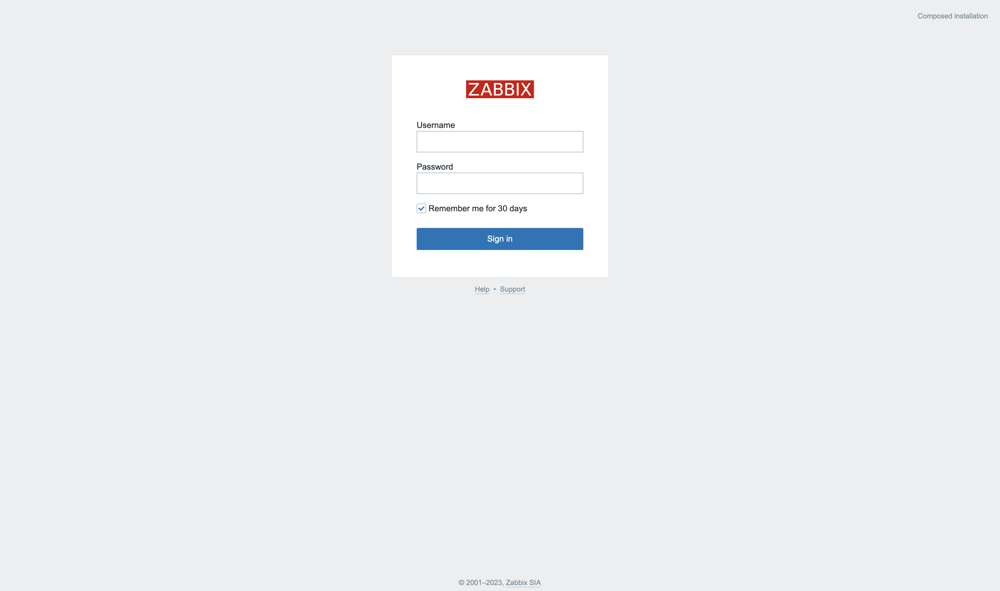
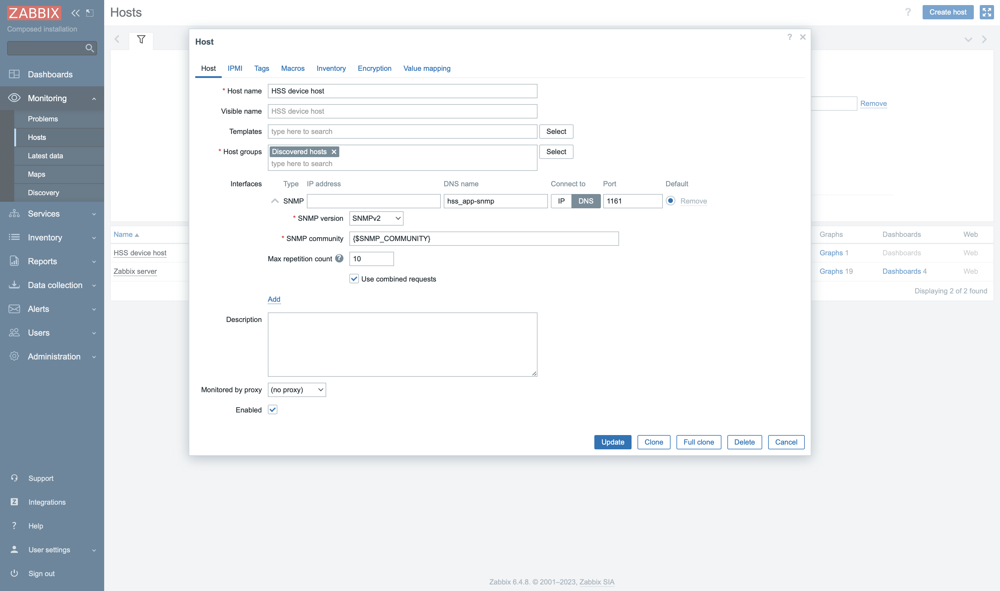
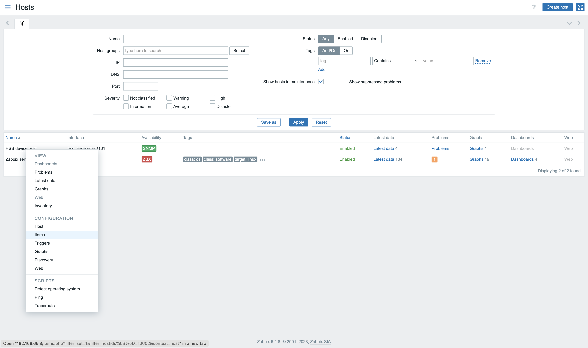
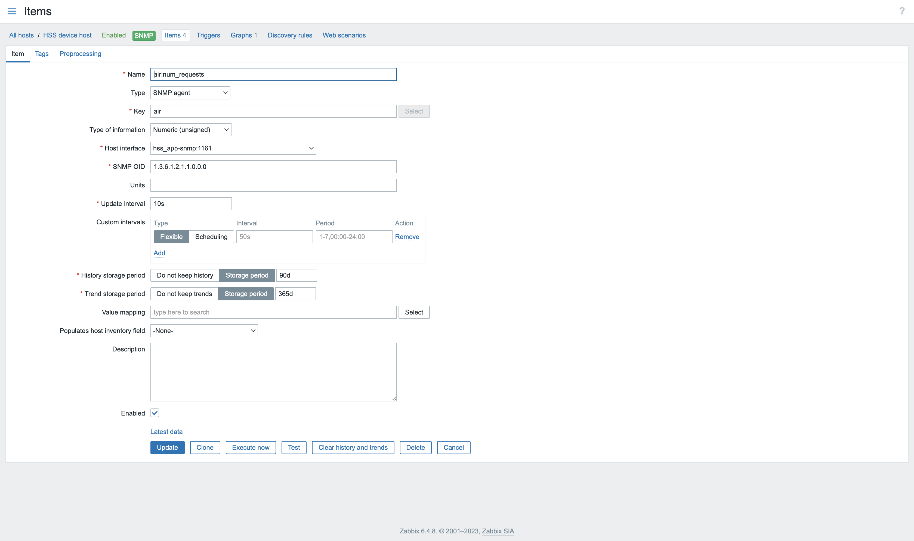
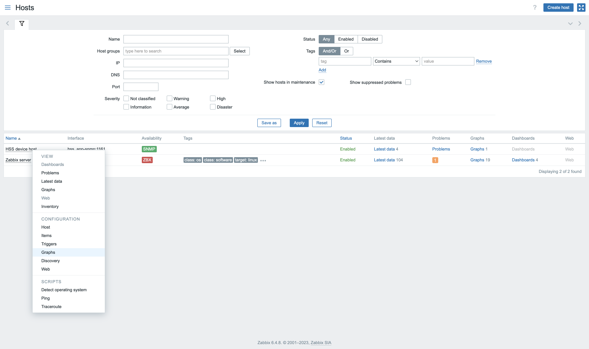
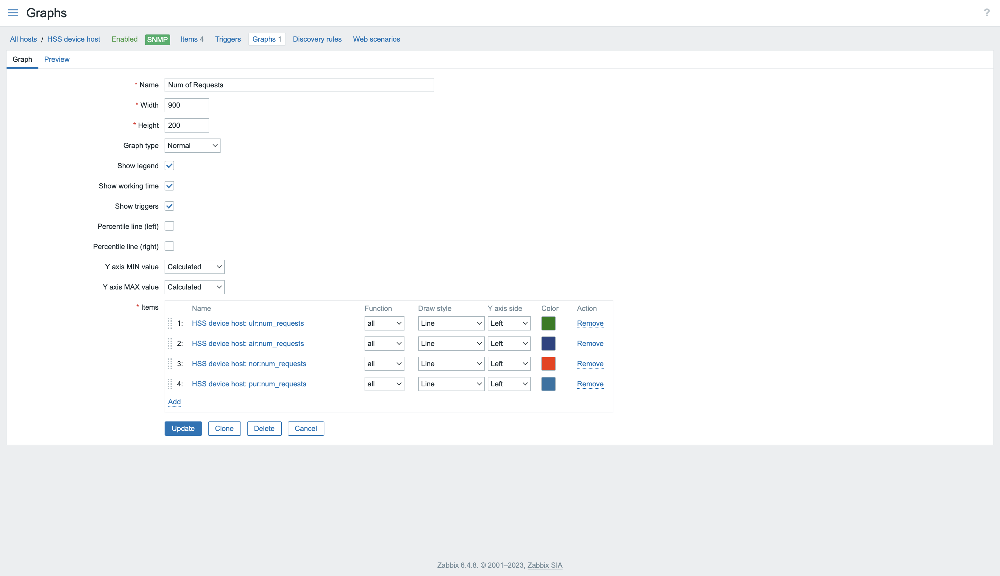
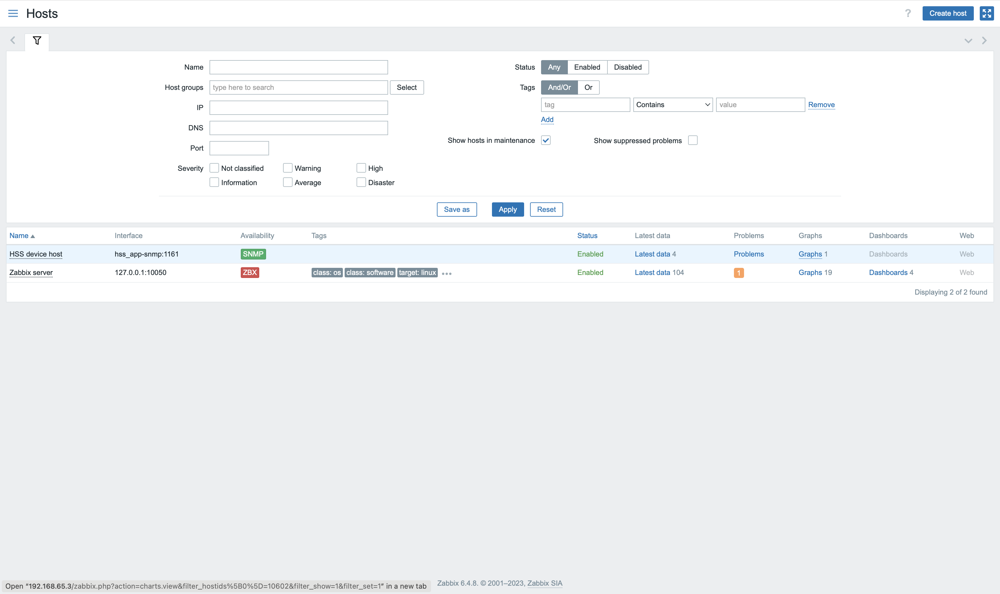
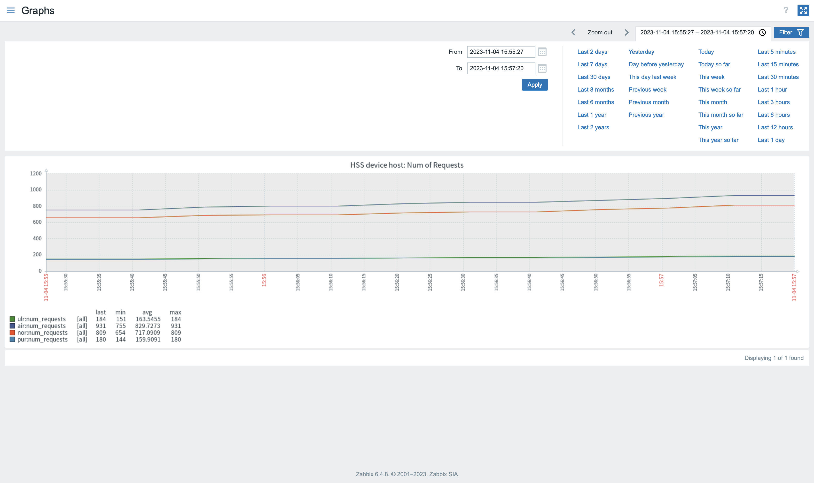

# Zabbix Integration with Bromélia HSS: Quick Setup Guide

**Zabbix** seamlessly integrates with **Bromélia HSS**, offering real-time SNMP-based monitoring capabilities.

## Table of Contents

- [Getting Started](#getting-started)
    - [Step 1: Log in to Zabbix](#step-1-log-in-to-zabbix)
    - [Step 2: Create a New Host](#step-2-create-a-new-host)
    - [Step 3: Configure Monitoring Items](#step-3-configure-monitoring-items)
    - [Step 4: Add Monitoring Items](#step-4-add-monitoring-items)
    - [Step 5: Configure Graphs](#step-5-configure-graphs)
    - [Step 6: Add Graph](#step-6-add-graph)
- [Monitoring KPIs](#monitoring-kpis)

## Getting Started

Follow these steps to set up Zabbix with Bromélia HSS effortlessly.

### Step 1: Log in to Zabbix

Ensure you are logged in to your Zabbix account.

### Step 2: Create a New Host

1. On the left sidebar, navigate to **Monitoring > Hosts**.
2. Click the **"Create host"** button located at the upper right corner.

### Step 3: Configure Monitoring Items

1. Click the newly created host.
2. In the drop-down like menu, go to the **Configuration** section and click on **Items**.

### Step 4: Add Monitoring Items

1. Click the **"Create item"** button located at the upper right corner.
2. Provide the required configurations for each Bromélia HSS Key Performance Indicator (KPI).
3. For SNMP-based monitoring, ensure to include the KPI's SNMP OID (Object Identifier). You can find a comprehensive list of available OIDs in the [oids.py](../hss_app/snmp/oids.py) file for reference.

### Step 5: Configure Graphs

1. Click the newly created host.
2. In the drop-down like menu, go to the **Configuration** section and click on **Graphs**.

### Step 6: Add Graph

1. Click the **"Create graph"** button located at the upper right corner.
2. Fill out the necessary parameters and choose the KPI you wish to monitor in the Items section at the end. The example below considers only the number of incoming Diameter requests.

Now you're all set to monitor your Bromélia HSS system using Zabbix. Happy monitoring!

## Monitoring KPIs

1. Ensure Bromélia HSS is up and running, and connect to a peer node to receive incoming Diameter requests.
2. Go back to **Monitoring > Hosts** and click the **Graphs** link in the host entry.

3. Now you can monitor the graph with the number of incoming Diameter requests.

